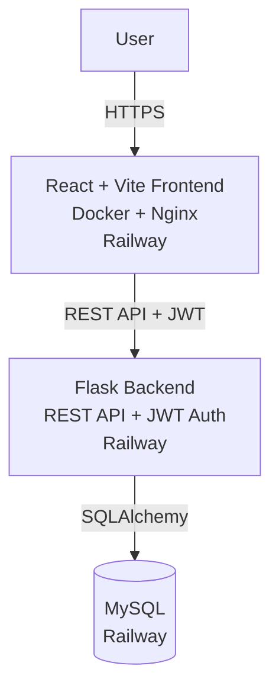
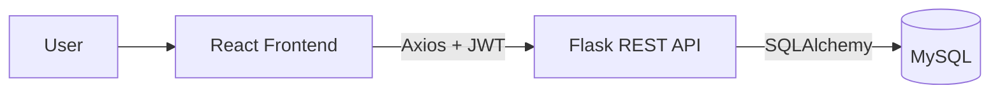
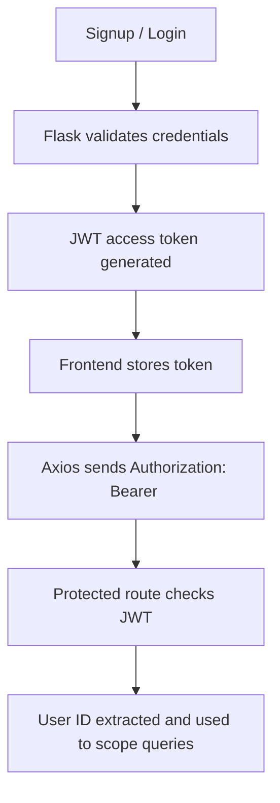

# TaskFlow

A full-stack task and project management application built with React, Flask, MySQL, JWT authentication, Docker, and Railway.

*By [Zaid Khan](https://www.linkedin.com/in/zaidkhan2703/)*

Users can create projects, organize tasks, manage task status, and securely access their own data through authenticated REST APIs.

[](https://github.com/Zaid-mzk/taskflow/actions/workflows/ci.yml)

**Live Demo:** https://taskflow-production-bf08.up.railway.app
**Backend Health:** https://distinguished-eagerness-production-5caa.up.railway.app/api/health

---

## Features

- User signup and login with JWT-based authentication
- Protected API routes scoped to the authenticated user
- User-specific project ownership and task access
- Full project CRUD (create, list, retrieve, delete)
- Full task CRUD (create, list, update, delete)
- Task status management: To Do, In Progress, Done
- Task filtering by status
- Project dashboard with task counts
- Input validation and cross-user access protection
- RESTful Flask API
- Automated backend tests with pytest
- Dockerized development environment and production frontend image
- Nginx-based frontend serving
- GitHub Actions CI
- Railway production deployment with managed MySQL

## Tech Stack

**Frontend:** React, Vite, Tailwind CSS, React Router, Axios
**Backend:** Python, Flask, Flask-SQLAlchemy, SQLAlchemy, Flask-JWT-Extended, PyMySQL
**Database:** MySQL
**Testing:** Pytest
**DevOps:** Docker, Docker Compose, Nginx, GitHub Actions, Railway

---

## Architecture

### Production



### Request Flow



The frontend reads its backend URL from the `VITE_API_URL` environment variable. Locally it points to the Flask dev server; in production it points to the deployed Railway backend.

### Authentication Flow



Protected routes require a valid JWT. The authenticated user's ID is extracted from the token and used to scope every project and task query, preventing cross-user access.

---

## API Reference

All endpoints are prefixed with `/api`. Protected endpoints require:

```http
Authorization: Bearer <JWT_TOKEN>
```

### Auth

```http
POST /api/auth/signup
POST /api/auth/login
```

### Projects

```http
GET    /api/projects
POST   /api/projects
GET    /api/projects/<project_id>
DELETE /api/projects/<project_id>
```

### Tasks

```http
GET    /api/projects/<project_id>/tasks
POST   /api/projects/<project_id>/tasks
PATCH  /api/tasks/<task_id>
DELETE /api/tasks/<task_id>
```

Tasks can be filtered by status:

```http
GET /api/projects/<project_id>/tasks?status=<todo|in_progress|done>
```

---

## Validation

The API validates user input and returns appropriate HTTP status codes with JSON error responses. Validated cases include:

- Required signup fields, email format, minimum password length
- Duplicate emails and usernames
- Required project names and task titles
- Supported task statuses
- Task due-date format
- Empty task titles during updates

---

## Testing

The backend test suite covers authentication, protected routes, project and task CRUD, task status updates, task filtering, validation, and cross-user access protection.

Run locally:

```bash
cd backend
pytest -v
```

## Continuous Integration

GitHub Actions runs on every push to `main` and on pull requests targeting `main`. Two jobs run in parallel:

- **Backend Tests** — Python 3.11 → install dependencies → `pytest`
- **Frontend Build** — Node.js 20 → install dependencies → Vite production build

This catches backend regressions and frontend build failures before merge or deploy.

---

## Running Locally with Docker

**Prerequisites:** Docker Desktop and Git.

```bash
git clone https://github.com/Zaid-mzk/taskflow.git
cd taskflow
docker compose up --build
```

Local endpoints:

| Service  | URL                       |
|----------|---------------------------|
| Frontend | http://localhost:5173     |
| Backend  | http://localhost:5000/api |
| MySQL    | localhost:3306            |

Stop the stack:

```bash
docker compose down
```

Remove containers and the local database volume:

```bash
docker compose down -v
```

## Running Without Docker

### Backend

```bash
cd backend
python -m venv venv
source venv/bin/activate          # Windows: venv\Scripts\Activate.ps1
pip install -r requirements.txt
cp .env.example .env              # Windows: Copy-Item .env.example .env
# Configure database values in .env, then:
python run.py
```

### Frontend

```bash
cd frontend
npm install
cp .env.example .env              # Windows: Copy-Item .env.example .env
npm run dev
```

---

## Environment Variables

### Backend (`backend/.env`)

Based on `backend/.env.example`:

```text
SECRET_KEY
JWT_SECRET_KEY
DATABASE_URL
```

In production, the backend uses the Railway-provided `DATABASE_URL` to connect to the managed MySQL instance.

### Frontend (`frontend/.env`)

Based on `frontend/.env.example`:

```text
VITE_API_URL=https://<backend-domain>/api
```

Secrets and environment-specific configuration should never be committed to Git.

---

## Docker

The local stack runs three services through Docker Compose: the React frontend, the Flask backend, and MySQL.

The production frontend uses a multi-stage build: Node.js installs dependencies and produces the Vite `dist/` output, which is then served by Nginx Alpine. The build accepts `VITE_API_URL` as a build argument so the production bundle points at the deployed backend.

---

## Project Structure

```text
taskflow/
├── .github/workflows/ci.yml
├── backend/
│   ├── app/
│   │   ├── routes/
│   │   │   ├── auth.py
│   │   │   ├── projects.py
│   │   │   └── tasks.py
│   │   ├── config.py
│   │   ├── extensions.py
│   │   ├── models.py
│   │   └── __init__.py
│   ├── tests/
│   │   ├── conftest.py
│   │   ├── test_auth.py
│   │   ├── test_projects.py
│   │   └── test_tasks.py
│   ├── Dockerfile
│   ├── requirements.txt
│   └── run.py
├── frontend/
│   ├── src/
│   │   ├── api/
│   │   ├── components/
│   │   ├── context/
│   │   ├── pages/
│   │   ├── App.jsx
│   │   ├── index.css
│   │   └── main.jsx
│   ├── Dockerfile
│   ├── nginx.conf
│   ├── package.json
│   ├── postcss.config.js
│   ├── tailwind.config.js
│   └── vite.config.js
├── docker-compose.yml
├── .gitignore
└── README.md
```

---

## Deployment

TaskFlow is deployed on Railway as three services connected through a private network:

- **Frontend Service** — Docker + Nginx, serving the production React build
- **Backend Service** — Docker + Gunicorn, exposing the Flask REST API
- **MySQL Service** — managed database accessed by the backend via `DATABASE_URL`

Pushes to `main` trigger automatic redeploys through Railway's GitHub integration.

---

## Author

**Zaid Khan**

- GitHub: [@Zaid-mzk](https://github.com/Zaid-mzk)
- LinkedIn: [zaidkhan2703](https://www.linkedin.com/in/zaidkhan2703/)
- Email: zaid270803@gmail.com

---

## Purpose

TaskFlow was built as an end-to-end engineering exercise covering REST API design, JWT authentication, relational data modeling, containerization, CI, and cloud deployment. It is intended to be read, run, and modified — issues and pull requests are welcome.