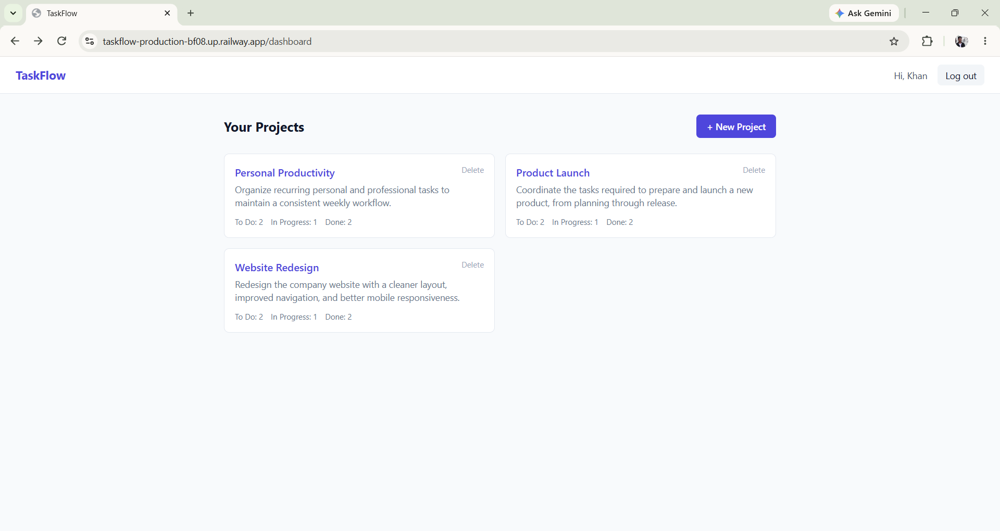
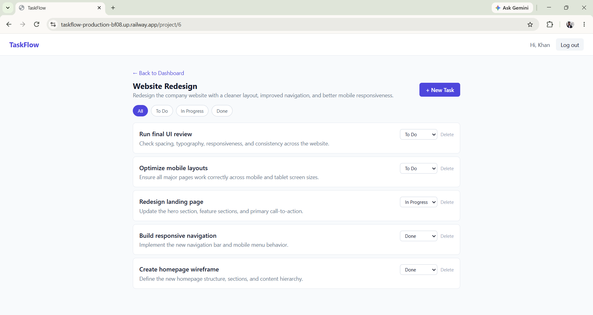
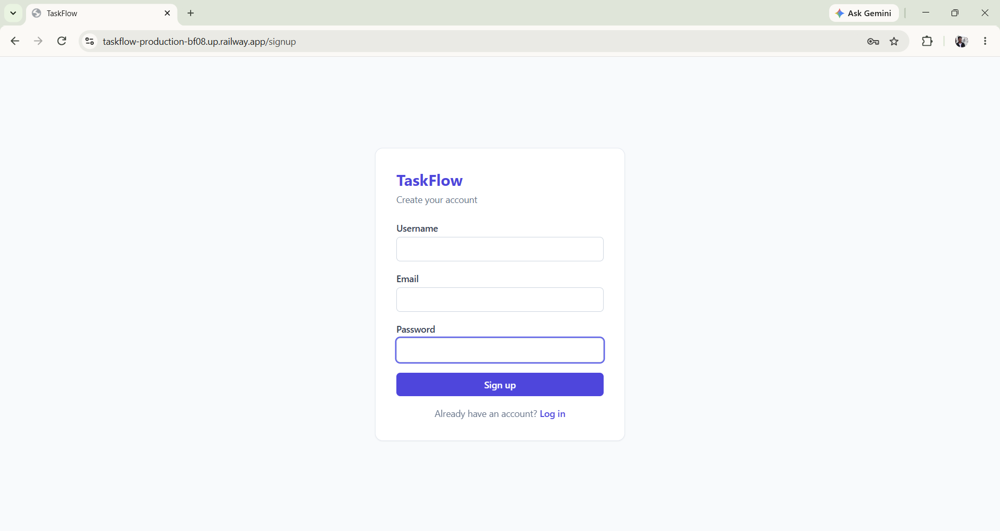

# TaskFlow

A full-stack task and project management application built with React, Flask, MySQL, JWT authentication, Docker, and Railway.

**By [Zaid Khan](https://www.linkedin.com/in/zaidkhan2703/)**

TaskFlow allows users to create projects, organize tasks, track task status, and securely manage their own data through authenticated REST APIs.

[](https://github.com/Zaid-mzk/taskflow/actions/workflows/ci.yml)

**Live Demo:** [https://taskflow-production-bf08.up.railway.app](https://taskflow-production-bf08.up.railway.app)

**API Health:** [https://distinguished-eagerness-production-5caa.up.railway.app/api/health](https://distinguished-eagerness-production-5caa.up.railway.app/api/health)

---

## Screenshots

### Dashboard



### Project & Task Management



### Authentication



---

## Features

- User signup and login with JWT-based authentication
- Protected API routes scoped to the authenticated user
- User-specific project ownership and task access
- Full project CRUD
- Full task CRUD
- Task status management: To Do, In Progress, Done
- Task filtering by status
- Project dashboard with task counts
- Input validation and cross-user access protection
- RESTful Flask API
- Automated backend tests with Pytest
- Dockerized development and production environments
- Nginx-based frontend serving
- GitHub Actions CI
- Railway production deployment with managed MySQL

---

## Tech Stack

**Frontend**

- React
- Vite
- Tailwind CSS
- React Router
- Axios

**Backend**

- Python
- Flask
- Flask-SQLAlchemy
- SQLAlchemy
- Flask-JWT-Extended
- PyMySQL

**Database**

- MySQL

**Testing**

- Pytest

**DevOps & Deployment**

- Docker
- Docker Compose
- Nginx
- GitHub Actions
- Railway

---

## Architecture

### Production Architecture

```text
                         HTTPS
                           │
                           ▼
                    ┌─────────────┐
                    │    User     │
                    └──────┬──────┘
                           │
                           ▼
              ┌────────────────────────┐
              │ React + Vite Frontend  │
              │ Docker + Nginx         │
              │ Railway                │
              └────────────┬───────────┘
                           │
                     REST API + JWT
                           │
                           ▼
              ┌────────────────────────┐
              │ Flask Backend          │
              │ REST API + JWT Auth    │
              │ Railway                │
              └────────────┬───────────┘
                           │
                       SQLAlchemy
                           │
                           ▼
              ┌────────────────────────┐
              │ MySQL                  │
              │ Railway                │
              └────────────────────────┘
```

### Request Flow

```text
User
 │
 ▼
React Frontend
 │
 │ Axios + JWT
 ▼
Flask REST API
 │
 │ SQLAlchemy
 ▼
MySQL
```

The frontend reads its backend URL from the `VITE_API_URL` environment variable. Locally it points to the Flask development server; in production it points to the deployed Railway backend.

### Authentication Flow

```text
Signup / Login
      │
      ▼
Flask validates credentials
      │
      ▼
JWT access token generated
      │
      ▼
Frontend stores token
      │
      ▼
Axios sends Authorization: Bearer <token>
      │
      ▼
Protected route checks JWT
      │
      ▼
User ID extracted and used to scope queries
```

Protected routes require a valid JWT. The authenticated user's ID is extracted from the token and used to scope project and task queries, preventing unauthorized cross-user access.

---

## API Reference

All endpoints are prefixed with `/api`.

Protected endpoints require:

```http
Authorization: Bearer <JWT_TOKEN>
```

### Authentication

```http
POST /api/auth/signup
POST /api/auth/login
```

### Projects

```http
GET    /api/projects
POST   /api/projects
GET    /api/projects/<project_id>
DELETE /api/projects/<project_id>
```

### Tasks

```http
GET    /api/projects/<project_id>/tasks
POST   /api/projects/<project_id>/tasks
PATCH  /api/tasks/<task_id>
DELETE /api/tasks/<task_id>
```

Tasks can be filtered by status:

```http
GET /api/projects/<project_id>/tasks?status=<todo|in_progress|done>
```

---

## Validation

The API validates user input and returns appropriate HTTP status codes with JSON error responses.

Validated cases include:

- Required signup fields
- Email format
- Minimum password length
- Duplicate emails and usernames
- Required project names
- Required task titles
- Supported task statuses
- Task due-date format
- Empty task titles during updates
- Unauthorized access to other users' resources

---

## Testing

The backend test suite covers:

- User authentication
- Protected routes
- Project CRUD
- Task CRUD
- Task status updates
- Task filtering
- Input validation
- Cross-user access protection

Run the tests locally:

```bash
cd backend
pytest -v
```

---

## Continuous Integration

GitHub Actions runs on every push to `main` and on pull requests targeting `main`.

Two jobs run in parallel:

**Backend Tests**

```text
Python 3.11

→ Install dependencies

→ Run Pytest
```

**Frontend Build**

```text
Node.js 20

→ Install dependencies

→ Build with Vite
```

This verifies backend tests and frontend production builds before changes are merged.

---

## Running Locally with Docker

### Prerequisites

- Docker Desktop
- Git

Clone the repository:

```bash
git clone https://github.com/Zaid-mzk/taskflow.git

cd taskflow
```

Start the application:

```bash
docker compose up --build
```

Local endpoints:

| Service | URL |
|---------|-----|
| Frontend | [http://localhost:5173](http://localhost:5173) |
| Backend | [http://localhost:5000/api](http://localhost:5000/api) |
| MySQL | localhost:3306 |

Stop the stack:

```bash
docker compose down
```

To remove containers and the local database volume:

```bash
docker compose down -v
```

---

## Running Without Docker

### Backend

```bash
cd backend

python -m venv venv
```

Activate the virtual environment:

```bash
# macOS / Linux

source venv/bin/activate

# Windows PowerShell

venv\Scripts\Activate.ps1
```

Install dependencies:

```bash
pip install -r requirements.txt
```

Create the environment file:

```bash
# macOS / Linux

cp .env.example .env

# Windows PowerShell

Copy-Item .env.example .env
```

Configure the database values in `.env`, then run:

```bash
python run.py
```

### Frontend

```bash
cd frontend

npm install
```

Create the environment file:

```bash
# macOS / Linux

cp .env.example .env

# Windows PowerShell

Copy-Item .env.example .env
```

Start the development server:

```bash
npm run dev
```

---

## Environment Variables

### Backend

`backend/.env`:

```text
SECRET_KEY

JWT_SECRET_KEY

DATABASE_URL
```

In production, the backend uses the Railway-provided `DATABASE_URL` to connect to the managed MySQL instance.

### Frontend

`frontend/.env`:

```text
VITE_API_URL=https://<backend-domain>/api
```

Secrets and environment-specific configuration should not be committed to Git.

---

## Docker

The local environment runs three services through Docker Compose:

```text
React Frontend
      │
      ▼
Flask Backend
      │
      ▼
    MySQL
```

The production frontend uses a multi-stage Docker build:

1. Node.js installs dependencies.

2. Vite generates the production `dist` output.

3. Nginx Alpine serves the generated frontend.

The production build accepts `VITE_API_URL` as a build argument so the frontend communicates with the deployed backend.

---

## Project Structure

```text
taskflow/

├── .github/
│   └── workflows/
│       └── ci.yml
│
├── backend/
│   ├── app/
│   │   ├── routes/
│   │   │   ├── auth.py
│   │   │   ├── projects.py
│   │   │   └── tasks.py
│   │   ├── config.py
│   │   ├── extensions.py
│   │   ├── models.py
│   │   └── __init__.py
│   │
│   ├── tests/
│   │   ├── conftest.py
│   │   ├── test_auth.py
│   │   ├── test_projects.py
│   │   └── test_tasks.py
│   │
│   ├── Dockerfile
│   ├── requirements.txt
│   └── run.py
│
├── frontend/
│   ├── src/
│   │   ├── api/
│   │   ├── components/
│   │   ├── context/
│   │   ├── pages/
│   │   ├── App.jsx
│   │   ├── index.css
│   │   └── main.jsx
│   │
│   ├── Dockerfile
│   ├── nginx.conf
│   ├── package.json
│   ├── postcss.config.js
│   ├── tailwind.config.js
│   └── vite.config.js
│
├── docs/
│   └── screenshots/
│       ├── dashboard.png
│       ├── project.png
│       └── signup.png
│
├── docker-compose.yml
├── .gitignore
└── README.md
```

---

## Deployment

TaskFlow is deployed on Railway as three services connected through a private network.

- **Frontend Service** — Docker + Nginx serving the production React build
- **Backend Service** — Docker + Gunicorn running the Flask REST API
- **MySQL Service** — managed MySQL database accessed by the backend through `DATABASE_URL`

The frontend communicates with the backend through the deployed API URL.

Changes pushed to `main` trigger automatic redeployment through Railway's GitHub integration.

---

## Author

**Zaid Khan**

- GitHub: [@Zaid-mzk](https://github.com/Zaid-mzk)
- LinkedIn: [zaidkhan2703](https://www.linkedin.com/in/zaidkhan2703/)
- Email: zaid270803@gmail.com

---

## Purpose

TaskFlow is an end-to-end task and project management application covering REST API design, JWT authentication, relational data modeling, CRUD operations, input validation, automated testing, containerization, CI, and cloud deployment.

The application is deployed and available through the live demo above.
